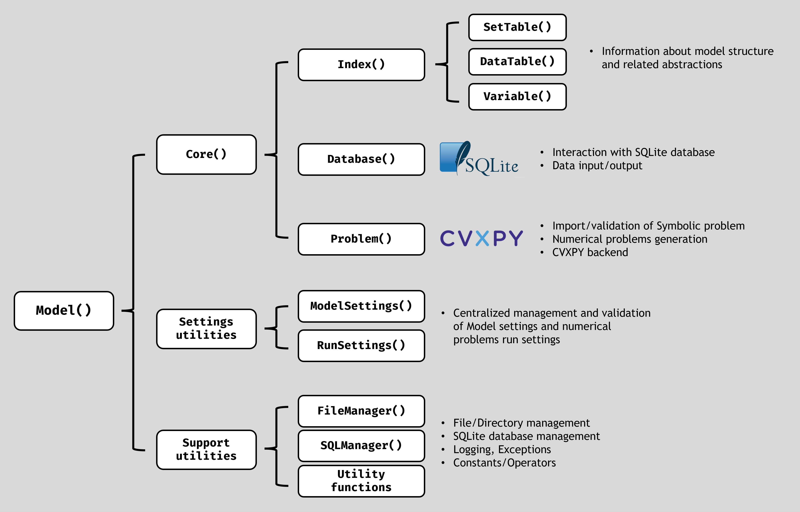

API reference
=============

CVXlab is designed to be intuitive enough so that it may be used without diving 
into APIs structures. Reading :ref:`User Guide <user_guide>`, practicing with the 
tutorial notebook available in the :ref:`Resources <resources>` section, and 
looking at existing models in :ref:`Models gallery <models_gallery>` will suffice 
in acquainting you with the package. Nonetheless, API reference are here included 
for those who are comfortable reading technical documentation. 

The package structure is illustrated in the figure below, where the main classes 
and their hierarchy are shown. At the top level, ``cvxlab.Model`` orchestrates 
the workflow by coordinating ``Core``, settings utilities, and support utilities. 
``Core`` groups modelling components (``Index``, ``Database``, and ``Problem``), 
with ``Index`` organizing structural abstractions (``SetTable``, ``DataTable``, 
and ``Variable``), while settings classes (``ModelSettings`` and ``RunSettings``) 
centralize configuration, and support classes (``FileManager``, ``SQLManager``, 
and utility functions) provide shared operational services.

.. _fig:package_structure:

The classes and functions documented in this section are those imported into the 
*CVXlab* namespace. The documentation is grouped in the following sections:

.. list-table:: API reference sections
   :header-rows: 1
   :widths: 20 80

   * - Section
     - Description
   * - :ref:`Model <api_model>`
     - Documents the main package class ``cvxlab.Model``, embedding all the main
       package APIs necessary to generate, handle and solve the numerical model.
   * - :ref:`Utility functions <api_utility_functions>`
     - Documents various utility functions available in the package, including the
       guided interactive interface (:py:func:`cvxlab.run`) and functions for
       initializing model directories and handling model class instances.
   * - :ref:`Symbolic operators <api_symbolic_operators>`
     - Documents built-in symbolic operators available in CVXlab, including
       standard arithmetic operations, matrix operations, and various mathematical
       functions. Provides guidelines on how to create new or add built-in
       symbolic operators to the package.
   * - :ref:`Constants <api_constants_types>`
     - Documents the various built-in constant data types available in CVXlab,
       necessary to assign numerical values to constants in numerical problems.
       Provides guidelines on how to create new or add built-in constant data
       types to the package.
   * - :ref:`Templates <api_templates>`
     - Documents the template modules included in the CVXlab package, including
       user-defined symbolic operators and user-defined constants.
   * - :ref:`Defaults <api_defaults>`
     - Documents the ``cvxlab.constants`` module, which includes various default
       settings used throughout the package that may be customized by the
       developer.

.. toctree::
   :hidden:
   :maxdepth: 1

   apidocs/model
   apidocs/utility_functions
   apidocs/symbolic_operators
   apidocs/constants_types
   apidocs/templates
   apidocs/defaults
