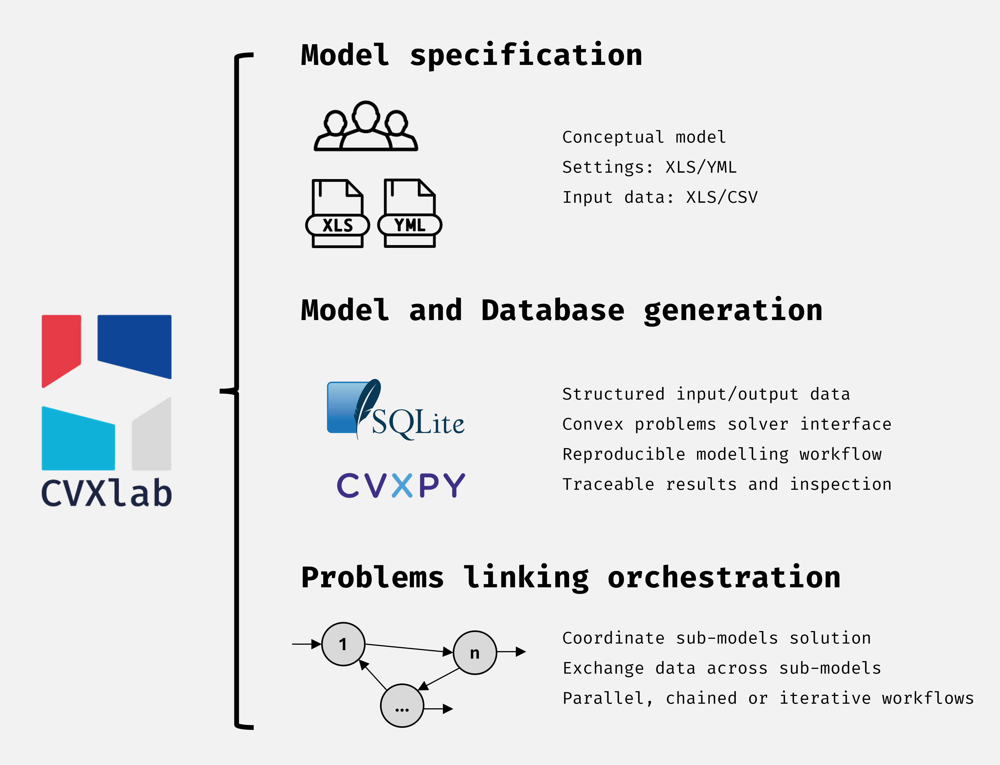

CVXlab documentation
====================

**CVXlab** is an open-source Python laboratory for creating and solving convex 
optimization models from low-level settings, structured data, and symbolic 
expressions. It combines *YAML* or *Excel*-based model setup, *SQLite*-backed 
data management, and *CVXPY*-based numerical solving in one unique and reproducible 
workflow. Beyond single-problem modeling, it can orchestrate linked optimization 
sub-models with managed data exchange in *parallel*, *sequential*, and 
*integrated* solution modes.

**Version:** |version|
**Date:** |today|

**Useful links**: `PyPI <https://pypi.org/project/cvxlab/>`_ | 
`Source code <https://github.com/cvxlab/cvxlab>`_ | 
`Issue tracker <https://github.com/cvxlab/cvxlab/issues>`_ | 
`GitHub discussions <https://github.com/cvxlab/cvxlab/discussions>`_

How it works
------------

The figure below summarizes the package workflow. The detailed step-by-step
explanation is in the :ref:`user_guide`, while runnable examples are collected
in the :ref:`resources` section.

.. _fig:cvxlab_in_a_nutshell:

Why CVXlab
----------

- **General-purpose model generator**. Build a wide range of convex optimization models.
- **Almost no code required**. Define model structure through *YAML* or *Excel* 
  templates instead of hand-coding every object.
- **Centralized data management**. Organize data in a *SQLite* database for 
  traceable, reusable data handling.
- **Linked-model orchestration**. Coordinate multiple optimization sub-models 
  and exchange data across independent, chained, or iterative solving workflows.
- **Powerful engine embedded**. Build convex and decomposed optimization workflows 
  on top of `CVXPY <https://www.cvxpy.org/tutorial/intro/index.html>`_.

Start here
----------

.. list-table::
  :header-rows: 1
  :widths: 24 76

  * - Section
    - What you will find
  * - :doc:`installation`
    - How to install CVXlab and verify that the environment is ready.
  * - :doc:`guided_interface`
    - How to use the menu-driven interface to configure and run a model.
  * - :doc:`user_guide`
    - The full modeling workflow, from conceptual model definition to results export.
  * - :doc:`resources`
    - Tutorials, models gallery, related publications and how to cite CVXlab.
  * - :doc:`api_reference`
    - Technical reference for ``cvxlab.Model``, utilities, operators, constants, and defaults.

.. toctree::
  :maxdepth: 1
  :hidden:

  Installation <installation>
  Interface <guided_interface>
  User Guide <user_guide>
  Resources <resources>
  API Reference <api_reference>
  Changelog <changelog>
  Contributing <contributing>

.. note::
  CVXlab is developed by `Matteo V. Rocco <https://www.energia.polimi.it/en/people/rocco-matteo-vincenzo-2/>`_,
  Associate Professor at *SESAM group*, `Department of Energy, Politecnico di Milano
  <https://www.energia.polimi.it/en/>`_. The project is released under the
  `Apache License 2.0 <http://www.apache.org/licenses/>`_.
