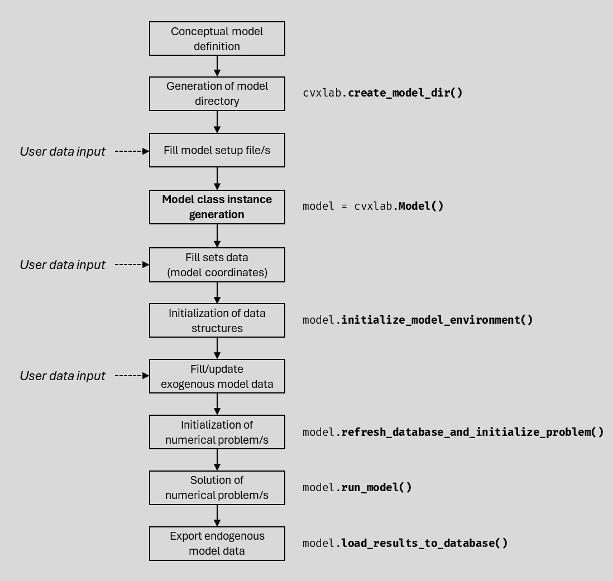
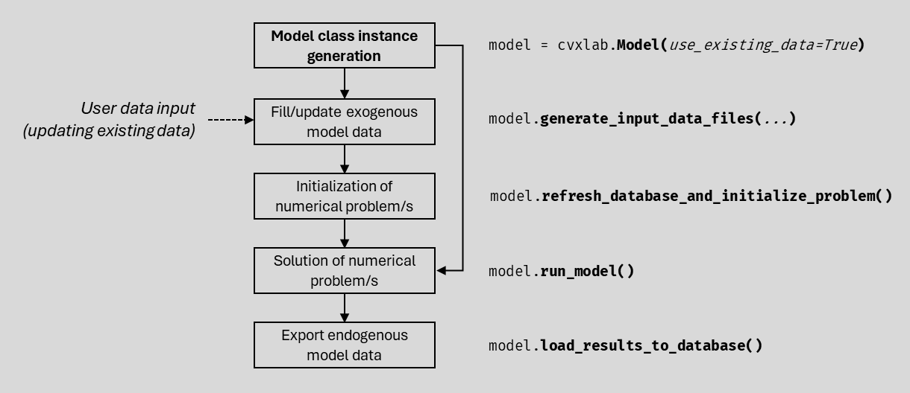

.. _user_guide:

User Guide
==========

This section provides a comprehensive guide to using CVXlab for conceptualizing,
generating and solving optimization problems. This includes all the necessary 
steps to :ref:`generate a model from scratch <model_generation_from_scratch>`, 
or to :ref:`generate it from existing settings/data <model_generation_from_existing>`. 
At the end of the section, a set of :ref:`utilities <utilities>` is provided
to generate/handle model directory, facilitate model properties and data inspections, 
saving and loading of model instances, refreshing model database.

Before diving into each single step, it is suggested to read all this page, which 
provides a synthetic but comprehensive overview about the CVXlab modeling workflow.

Tutorial with CVXlab applications are available in :ref:`tutorials` section.

.. _guided_interface:

Guided interface (quick start)
------------------------------

For users who prefer a plug-and-play experience, CVXlab provides an interactive 
guided interface that walks through the entire modeling workflow via a menu-driven 
session. This is the simplest way to get started with CVXlab:

.. code-block:: python

   import cvxlab
   
   cvxlab.run()

The ``run()`` function launches an interactive session that guides the user through 
model directory generation, setup, data loading, problem solving, and results export.
All parameters (solver, log level, convergence settings, etc.) can be passed directly 
or configured interactively. The idea is that if arguments are not passed, the user 
is *interactively prompted to provide the necessary information at each step*, with
sensible defaults provided for all parameters.

The interface is ideal to avoid direct interaction with the underlying APIs; however,
model formulation, settings, and data input must still be provided through the expected 
setup files and data structures, as described in the following sections.

For full control over each modeling step, refer to the programmatic workflows below.

API: :py:func:`cvxlab.run`

.. _model_generation_from_scratch:

Model generation from scratch
-----------------------------

The CVXlab modeling workflow for generating a model from scratch is summarized 
in the figure below, where steps are highlighted and numbered in boxes, while 
expected activities to be performed by the user and APIs provided by CVXlab are
indicated alongside boxes.

.. _fig:cvxlab_workflow_scratch:

**Complete application example: programmatic workflow**

Here is a complete example of the typical programmatic workflow for generating, 
initializing, solving, and exporting results for a CVXlab model. Each step 
corresponds to a key stage in the modeling process, as detailed below:

.. code-block:: python

   import cvxlab

   # Create model directory and setup files
   cvxlab.create_model_dir(...)

   # Fill model setup file(s)

   # Create Model instance
   model = cvxlab.Model(...)

   # Fill sets data (coordinates)

   # Initialization of data structures
   model.initialize_model_environment()

   # Fill input data Excel file(s)

   # Initialization of numerical problem(s)
   model.refresh_database_and_initialize_problem(...)

   # Solve the numerical problem(s)
   model.run_model(...)
    
   # Export all results to the database
   model.load_results_to_database(...)

**Step by step description of the CVXlab modeling workflow:**

-  :ref:`conceptual-model-definition`: the whole CVXlab modeling process must be 
   grounded on a solid conceptualization and mathematical definition of the problem 
   to be solved. This step consists in defining the fundamental model 
   structure pen-on-paper. The following items must be defined:

   - :ref:`defining-sets`: the dimensions of the model, defining its scope.
   - :ref:`definig-data-tables-variables`: *data tables* are defined as collection 
     of model data identified by one or more sets. *Variables* are symbolic items 
     pointing to all or a subsets of data entries in data tables.
   - :ref:`definig-expressions-and-problems`: *problems* are collection of 
     *expressions*, the latter defined as symbolic items constructed relying on 
     defined *variables* and *symbolic operators*. More than one problem can be 
     stated, each defined as a system of linear equalities or as a convex 
     optimization problems. 

   Once the problem is well defined, the CVXlab modeling process can start.

-  :ref:`generation-of-model-directory`: a model directory is generated based on 
   a predefined template, and it contains all the necessary files to transpose 
   the conceptual model into a CVXlab model instance. Setup files can be generated 
   as *YAML* or *Excel* formats, depending on user's preference. 
   Eventually, *Python template modules* can be included in the model directory to
   extend CVXlab functionalities with user-defined symbolic operators 
   (``user_defined_operators.py``) and user-defined constants data types 
   (``user_defined_constants.py``).

   API: :py:func:`cvxlab.create_model_dir`
   
-  :ref:`fill-model-setup-files`: the user translates the conceptual model into 
   the setup files available in the model directory. The setup information can be
   provided in either *YAML* format (as three separate files) or *Excel* format (one 
   file with three tabs):

   - **Structure of sets**: defined in ``structure_sets.yml`` or ``structure_sets`` tab.
   - **Structure of data tables and variables**: defined in ``structure_variables.yml``
     or ``structure_variables`` tab
   - **Mathematical problem**: defined in ``problem.yml`` or ``problem`` tab.

   User-defined symbolic operators and constants data types can be finally 
   implemented in dedicated Python modules templates eventually included in the 
   model directory.

-  :ref:`generate-model-class-instance`: the instance of the Model class is 
   generated through the *Model class constructor*, which translates the 
   information provided by setup file/s into a Python object. The model instance 
   includes all the necessary information and the APIs to generate and to solve 
   numerical problems, and to handle exogenous/endogeous model data.
   The model instance generation automatically triggers the generation of the 
   Excel file ``sets.xlsx`` to be filled with the *sets coordinates* (see 
   :ref:`Fill sets data (model coordinates) <fill-sets-data>`).
   During the Model class instantiation, a comprehensive validation of model
   structure is performed to ensure that all model components are correctly and 
   consistently defined.

   API (class constructor): :py:class:`cvxlab.Model`
 
-  :ref:`fill-sets-data`: the user fills the sets Excel file with the elements 
   belonging to each set, defined as *coordinates*. The Excel file includes one 
   tab per each set, where user can eventually specify other set attributes, such
   as set *filters* and *aggregation* categories.
   Once this step is completed, all the necessary information defining the model 
   structure is available, and the data structures can be generated.

-  :ref:`data-structures-init`: this step includes fetching sets coordinates to
   the model instance, performing a coherence check to ensure a correct definition
   of variables, and generating the necessary data structures, including:

   - **Blank SQLite database**: a relational database with *set tables* and *data 
     tables*, linked by univocal relations.
   - **Blank Excel input data file/s**: one or more Excel file/s (depending on user's 
     preference) with *exogenous data tables* printed out as normalized data tables,
     to be filled by the user (see :ref:`Fill exogenous model data <fill-exogenous-data>`).

   API: :py:func:`cvxlab.Model.initialize_model_environment`

-  :ref:`fill-exogenous-data`: user fills the Excel input data file/s with the 
   exogenous data tables values. In case of models with large amount of data, this
   step can be critical, time consuming and highly prone to errors. To facilitate
   this task, CVXlab provides features to limit the amount of data entries to be
   filled (as example: in settings, a default value can be defined for data table 
   entries in case of missing data).
   Once this step is completed, the numerical model can be generated and solved.

-  :ref:`numerical-problem-init`: this step includes fetching exogenous data from
   excel input data file/s to the model SQLite database, loading symbolic problem/s 
   from model settings, and generating the numerical problem/s (as *CVXPY* problem 
   object).
   During the problem generation step, a comprehensive validation of symbolic problem 
   and model data is performed to ensure that the symbolic problem is consistently 
   defined, and that all necessary data entries are correctly provided.

   API: :py:func:`cvxlab.Model.refresh_database_and_initialize_problem`

-  :ref:`numerical-problem-run`: in this step, the numerical problem/s are solved
   based on user settings, including selection of the adopted solver, the related 
   verbosity level, and other numerical settings.

   API: :py:func:`cvxlab.Model.run_model`

-  :ref:`export-model-results`: in case numerical problem/s have successfully
   solved, numerical results are exported to endogenous data tables of the 
   SQLite database.

   API: :py:func:`cvxlab.Model.load_results_to_database`

.. _model_generation_from_existing:

Model generation from existing settings/data
--------------------------------------------

The CVXlab modeling workflow for generating a model from existing setup file/s
and data structures is summarized by the figure below, where steps are highlighted 
and numbered in boxes, while expected activities to be performed by the user and 
APIs provided by CVXlab are indicated alongside boxes.

.. _fig:cvxlab_workflow_existing:

**Complete application example: programmatic workflow**

Here is a complete example of the typical programmatic workflow for generating, 
solving, and exporting results for a CVXlab model from existing settings and data. 
Each step corresponds to a key stage in the modeling process, as detailed below:

.. code-block:: python

   import cvxlab

   # Create Model instance
   model = cvxlab.Model(...)

   # [OPTIONAL] Fill/update input data Excel file(s)

   # [OPTIONAL] Initialization of numerical problem(s)
   model.refresh_database_and_initialize_problem(...)

   # Solve the numerical problem(s)
   model.run_model(...)
    
   # Export all results to the database
   model.load_results_to_database(...)

**Step by step description of the CVXlab modeling workflow:**

-  :ref:`generate-model-class-instance`: the instance of the Model class is 
   generated through the *Model class constructor* as the first step, specifying
   that the model relies on existing data (i.e. by passing ``use_existing_data=True`` 
   to the constructor). 
   Beside setup file/s (see :ref:`Fill model setup file/s <fill-model-setup-files>`), 
   other data structures must be present in the model directory, including the 
   sets Excel file filled with the related coordinates (see :ref:`Fill sets data 
   (model coordinates) <fill-sets-data>`), the blank SQLite database (with set 
   tables and data tables, see :ref:`Initialization of data structures 
   <data-structures-init>`), and the Excel input data directory (see :ref:`Fill 
   exogenous model data <fill-exogenous-data>`). 
   
   The Model constructor checks and validate the model directory structure and 
   the presence of all necessary files. Then, it loads the structures of sets,
   data tables and variables in the index, and fetches problems from the setup 
   file/s. Then it loads coordinates from the sets Excel file to the model instance. 
   Finally, it initializes numerical problem/s and fetches exogenous data from the 
   SQLite database. The model instance includes all the necessary information and 
   the APIs to generate and to solve numerical problems, and to handle model data.

   API (class constructor): :py:class:`cvxlab.Model`

-  :ref:`fill-exogenous-data`: (**optional**) in this step, user may update exogenous 
   model data in the Excel file/s. This step is especially useful in case of 
   multiple consecutive model runs, where only exogenous data are changed.
   If needed, one or more blank input data file/s can be re-generated from the 
   blank SQLite database. 

   API: :py:func:`cvxlab.Model.generate_input_data_files`

-  :ref:`numerical-problem-init`: (**optional**) this step needs to be made in case
   of exogenous data have updated (see :ref:`Fill exogenous model data 
   <fill-exogenous-data>`). It fetches exogenous data from the Excel input data 
   files to the SQLite database, updating data in numerical problem/s variables.

   API: :py:func:`cvxlab.Model.refresh_database_and_initialize_problem`

-  :ref:`numerical-problem-run`: in this step, the numerical problem/s are solved
   based on user settings, including the adopted solver, the related verbosity level, 
   and other settings.

   API: :py:func:`cvxlab.Model.run_model`

-  :ref:`export-model-results`: in case numerical problem(s) have successfully 
   solved, numerical results are exported to the endogenous data tables of the 
   SQLite database. 

   API: :py:func:`cvxlab.Model.load_results_to_database`
   

.. _utilities:

Utilities
---------

During the modeling process, or once the model is generated and solved, the user 
may need to inspect model properties, or doing some basic operations on the database.
CVXlab provides a set of utilities to facilitate these tasks, including:

*Model properties* can be inspected, including sets, data tables, variables, problems 
and expressions. This is especially useful to check that the model has been correctly 
defined and generated.

- :py:attr:`cvxlab.Model.sets`: list of model sets keys.
- :py:attr:`cvxlab.Model.data_tables`: list of model data tables keys.
- :py:attr:`cvxlab.Model.variables`: list of model variables keys.
- :py:attr:`cvxlab.Model.is_problem_solved`: indicates the status of the numerical problem.
      
*Detailed model features* can be inspected through dedicated methods.

- :py:func:`cvxlab.Model.set`: allows to inspect a specific set, including 
  the related coordinates and other attributes.
- :py:func:`cvxlab.Model.variable`: allows to inspect a specific variable, 
  including the related data table, shape, filters and other attributes.
   
*Other helper methods* allow to perform basic operations on the model instance 
and on the SQLite database.

- :py:func:`cvxlab.Model.reinitialize_sqlite_database`: allows to re-generate 
  a blank SQLite database, based on the current model structure (i.e. sets 
  and data tables). This is useful in case the user wants to reset all data 
  in the database, to be sure the database is starting from a clean status.
- :py:func:`cvxlab.Model.check_model_results`: allows to compare the model 
  SQLite database with a reference SQLite database, to check that results 
  are coherent with expected values.
- :py:func:`cvxlab.Model.update_sets_tables`: allows to update sets tables in 
  the SQLite database based on the current model structure and coordinates. 
  This is useful in case the user wants to update sets coordinates after the 
  model instance has been generated (e.g. for adding further aggregations 
  categories).

.. toctree::
   :maxdepth: 1
   :hidden:
   :caption: Modeling workflow steps

   user_guide_steps/conceptual_model_definition
   user_guide_steps/model_directory_generation
   user_guide_steps/fill_model_setup_files
   user_guide_steps/generate_model_instance
   user_guide_steps/fill_sets_data
   user_guide_steps/data_structures_init
   user_guide_steps/fill_exogenous_data
   user_guide_steps/numerical_problem_init
   user_guide_steps/numerical_problem_run
   user_guide_steps/export_model_results

