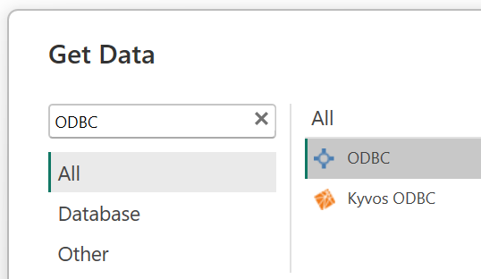
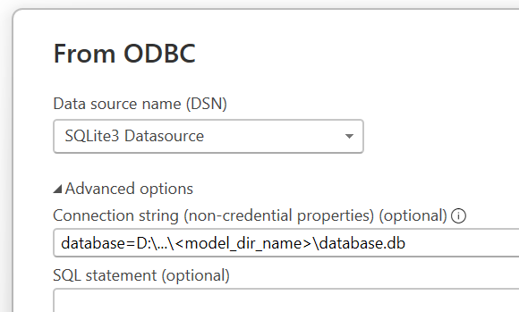

.. _export-model-results:

Export endogenous model data
============================

This step exports the results (endogenous variable values) of the solved 
numerical problem(s) to the model's SQLite database. This enables further 
analysis, reporting, or comparison of results across scenarios.

Overview
--------

- Exports solved endogenous variable data from the in-memory model to the SQLite database.
- Can export results for all scenarios or for a specified subset.
- Supports overwriting existing results and suppressing warnings as needed.
- Ensures that results are only exported if the model has been successfully solved.

API: :py:meth:`~cvxlab.Model.load_results_to_database`

Typical Usage
-------------

.. code-block:: python

    import cvxlab

    # Previous steps: 
    # - Create model directory and setup files
    # - Create Model instance
    # - Fill sets data (coordinates)
    # - Initialization of data structures
    # - Fill input data Excel file(s)
    # - Initialization of numerical problem(s)
    # - Solve the numerical problem(s)
    
    # [CURRENT STEP] Export all results to the database
    model.load_results_to_database(...)

Parameters description
----------------------

.. list-table::
   :header-rows: 1
   :widths: 25 55 20

   * - Parameter
     - Description
     - Default
   * - ``scenarios_idx``
     - A single scenario index or a list of scenario indices to export. If
       ``None``, results for all scenarios are exported.
     - ``None``
   * - ``force_overwrite``
     - If ``True``, overwrites existing results in the database without
       confirmation.
     - ``False``
   * - ``suppress_warnings``
     - If ``True``, suppresses warnings during export, for example in case of
       re-exporting unchanged numerical values.
     - ``False``

Workflow
--------

When :py:meth:`~cvxlab.Model.load_results_to_database` is called on a Model instance:

- Checks if the model has been solved (i.e., results are available). If not, 
  logs a warning and aborts export.
- For each scenario (or the specified subset), exports the solved endogenous 
  variable values to the SQLite database.
- If ``force_overwrite`` is True, existing results in the database are replaced.
- If ``suppress_warnings`` is True, any warnings during the export are suppressed.

SQLite database inspection
--------------------------

Once the results are exported, the SQLite database can be inspected with
different tools depending on the analysis workflow.

.. rubric:: Approach 1: direct database inspection

For quick inspection, table browsing, or ad hoc SQL queries, the database can
be opened directly with tools such as:

- *Visual Studio Code*, using a SQLite extension.
- `SQLiteStudio <https://sqlitestudio.pl/>`_.

This approach is useful when the goal is to inspect table contents, verify the
exported data, or run custom SQL queries directly on the database.

.. rubric:: Approach 2: Business Intelligence software

The SQLite database can also be connected to business intelligence software for
reporting and interactive analysis. One possible workflow is to import the
database into Power BI. Requirements:

- Power BI Desktop
- a SQLite ODBC connector, for example
  `SQLite ODBC Driver <http://www.ch-werner.de/sqliteodbc/>`_

After installing both tools, the SQLite database can be imported into Power BI
together with all its tables. In Power BI desktop, from the **Get Data** menu, 
select **ODBC**, then choose the SQLite ODBC data source and select the database 
file (see figures below). 

Once imported, the tables will be available in Power BI for building reports, 
visualizations, and performing further analysis.
In typical cases, the database relational structure is recognized during import, 
so the model is immediately available for further inspection with DAX measures, 
calculated columns, and standard Power BI reports.

